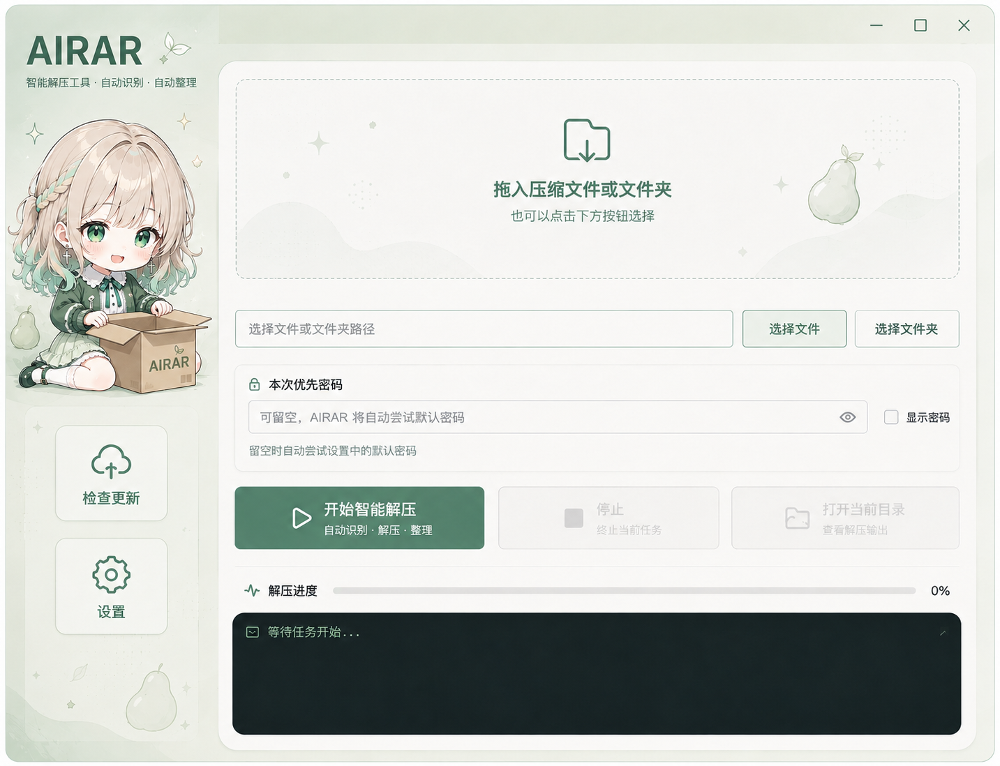

<div align="center">
  
  <h1>AIRAR</h1>
  <p><strong>智能解压工具 · 自动识别 · 自动整理</strong></p>
  <p><a href="README_EN.md">English</a> · <a href="https://github.com/wwvvv/AIRAR/releases/latest">下载最新版</a></p>
</div>



## 软件介绍

AIRAR 是一款面向 Windows 的智能递归解压与游戏文件整理工具。它可以识别伪装后缀和嵌套压缩包，按顺序尝试多个解压密码，并在解压完成后自动提取游戏目录与 APK 文件。

## 主要功能

- **拖放解压**：将压缩文件或文件夹直接拖入窗口。
- **真实格式识别**：根据文件特征识别 ZIP、RAR、7Z、TAR、GZ、BZ2 等格式，包括伪装后缀。
- **递归解压**：自动处理解压结果中的嵌套压缩包。
- **多密码匹配**：可在设置中保存多个默认密码，AIRAR 会从上到下依次尝试。
- **分卷 RAR**：只从 `part1` 首卷开始，避免重复处理和误删分卷。
- **游戏文件整理**：自动将游戏目录和 APK 文件移动到压缩包所在目录。
- **广告规则清理**：支持 `*` 和 `?` 通配符，清理匹配的广告文件或目录。
- **游戏存档保护**：保护 `.save`、`.sav`、`persistent`、Ren'Py 文件及常见游戏资源。
- **密码脱敏**：运行日志不会显示实际解压密码。

## 下载与使用

1. 前往 [Releases](https://github.com/wwvvv/AIRAR/releases) 下载 `AIRAR-v1.0.1-windows-x64.exe`。
2. 核对发布页面提供的 SHA-256。
3. 将压缩文件或文件夹拖入 AIRAR，也可以使用文件选择按钮。
4. 可填写本次优先密码；留空时自动尝试设置中的默认密码。
5. 点击“开始智能解压”。

> AIRAR 调用系统中可用的解压后端。处理 RAR、7Z 或 AES 加密 ZIP 时，建议安装最新版 7-Zip 或 WinRAR。

## 整理与数据说明

- 原始压缩包及原始分卷会保留。
- AIRAR 只清理本轮成功解压产生的中间内容。
- 游戏目录通过 `.exe`、`UnityPlayer.dll`、`GameAssembly.dll` 等标志识别。
- 默认密码和广告规则保存在 `%APPDATA%\AIRAR\settings.json`。
- 默认密码目前以本地 JSON 文本保存，请勿填写高价值账户密码。
- 同名输出不会直接覆盖，程序会自动增加数字后缀。

## 从源码运行

需要 Windows 10/11 和 Python 3.13。

```powershell
python -m venv .venv
.\.venv\Scripts\Activate.ps1
pip install -r requirements.txt
python src\airar.py
```

## 构建

```powershell
.\build.ps1
```

成品输出到 `dist\AIRAR.exe`。

## 项目结构

```text
assets/              软件图标、角色插画和界面配图
src/airar.py         应用程序源码
requirements.txt     运行与构建依赖
build.ps1            Windows 构建脚本
tests/               回归测试
```

## 当前版本

**1.0.1**

- [下载页面](https://github.com/wwvvv/AIRAR/releases/tag/v1.0.1)
- [检查更新](https://www.acgxx.com)

## 文件校验

`AIRAR-v1.0.1-windows-x64.exe`

`SHA-256: 340C5CB4E4D03D7A792DEDE973A7B132F8F73BBE2C8958BA89E2675324179E82`